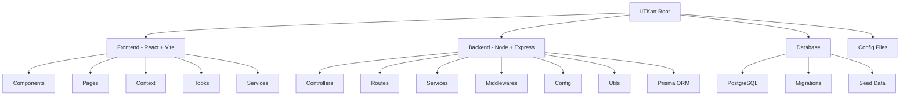

# IITKart

Backend documentation at `backend/README.md`

## Frontend

```bash
# Commands to start development server
npm install
npm run dev
```

# Planned Structure


## Project Structure Diagram



This diagram represents the high-level monorepo architecture of IITKart.

---

## 1. Root Directory

```
IITKart/
├── frontend/                 
├── backend/                  
├── database/                 
├── .gitignore                
├── README.md                 
└── package.json              
```

---

## 2. Backend Structure

```
backend/
├── src/
│   ├── config/               # Configuration files
│   │   ├── env.ts            # Environment variable validation (Zod/Dotenv)
│   │   ├── cors.ts           # CORS security options
│   │   └── db.ts             # Database connection initialization
│   │
│   ├── controllers/          # Request Handlers (Entry point for API calls)
│   │   ├── authController.ts # Login, Register, OTP, Password Reset
│   │   ├── userController.ts # Profile, Wallet, Address management
│   │   ├── vendorController.ts # Menu management, Shop status, Analytics
│   │   ├── riderController.ts  # Delivery requests, Status toggling
│   │   ├── adminController.ts  # Platform moderation, User management
│   │   ├── orderController.ts  # Order placement, Tracking, Status updates
│   │   └── paymentController.ts # Payment gateway webhooks
│   │
│   ├── middlewares/          # Express Middlewares
│   │   ├── authMiddleware.ts # JWT verification & RBAC (Role-Based Access Control)
│   │   ├── errorMiddleware.ts # Global error handling wrapper
│   │   ├── validateRequest.ts # Request body schema validation (Zod)
│   │   └── uploadMiddleware.ts # File upload handling (Multer)
│   │
│   ├── routes/               # API Route Definitions
│   │   ├── authRoutes.ts     # /api/auth
│   │   ├── userRoutes.ts     # /api/users
│   │   ├── vendorRoutes.ts   # /api/vendors
│   │   ├── riderRoutes.ts    # /api/riders
│   │   ├── adminRoutes.ts    # /api/admin
│   │   └── orderRoutes.ts    # /api/orders
│   │
│   ├── services/             # Business Logic Layer
│   │   ├── authService.ts    # Hashing, Token generation logic
│   │   ├── orderService.ts   # Complex order processing logic
│   │   ├── paymentService.ts # Interactions with Payment Gateway APIs
│   │   └── notificationService.ts # Email/SMS/Push notification triggers
│   │
│   ├── utils/                # Shared Utilities
│   │   ├── AppError.ts       # Custom error class
│   │   ├── logger.ts         # Logging configuration (Winston/Morgan)
│   │   └── helpers.ts        # Common helper functions
│   │
│   ├── app.ts                # Express app configuration (Middlewares, Routes)
│   └── server.ts             # Server entry point (Port listening)
│
├── prisma/                   # Database ORM
│   ├── schema.prisma         # PostgreSQL Schema definition
│   ├── migrations/           # SQL Migration history
│   └── seed.ts               # Script to populate DB with dummy data
│
├── tests/                    # Unit and Integration Tests
├── .env                      # Environment secrets (DB_URL, JWT_SECRET)
├── package.json              # Backend dependencies
└── tsconfig.json             # TypeScript config
```

---

## 3. Frontend Structure

```
frontend/
├── public/                   # Static Assets (Favicon, manifest.json)
│
├── src/
│   ├── assets/               # Source Assets (Images, Icons, Fonts)
│   │
│   ├── components/           # UI Components
│   │   ├── ui/               # Reusable atomic elements (Buttons, Inputs, Modals)
│   │   ├── layout/           # Structural components (Navbar, Sidebar, Footer)
│   │   ├── common/           # Generic components (Loaders, ErrorBoundaries)
│   │   └── features/         # Feature-specific components
│   │       ├── cart/         # Cart drawer, Cart items
│   │       ├── map/          # Map integration components
│   │       └── products/     # Product cards, Filters
│   │
│   ├── context/              # Global State Management (React Context)
│   │   ├── AuthContext.tsx   # User session state
│   │   ├── CartContext.tsx   # Shopping cart state
│   │   └── SocketContext.tsx # WebSocket connection for real-time updates
│   │
│   ├── hooks/                # Custom React Hooks
│   │   ├── useAuth.ts
│   │   ├── useFetch.ts
│   │   └── useDebounce.ts
│   │
│   ├── layouts/              # Page Layout Wrappers
│   │   ├── MainLayout.tsx    # Standard user layout
│   │   ├── DashboardLayout.tsx # Layout for Vendors/Admin
│   │   └── AuthLayout.tsx    # Layout for Login/Register pages
│   │
│   ├── pages/                # Application Views (Routes)
│   │   ├── auth/             # Login, Signup, Forgot Password
│   │   ├── customer/         # Home, Restaurant Menu, Checkout, Profile
│   │   ├── vendor/           # Dashboard, Menu Editor, Order History
│   │   ├── rider/            # Active Delivery, Earnings, History
│   │   └── admin/            # Analytics, User Management
│   │
│   ├── services/             # API Client (Axios/Fetch)
│   │   ├── api.ts            # Axios instance with interceptors
│   │   └── endpoints/        # API call functions grouped by domain
│   │
│   ├── types/                # TypeScript Interfaces/Types
│   │   ├── models.ts         # User, Order, Product interfaces
│   │   └── apiResponse.ts    # Standard API response types
│   │
│   ├── utils/                # Frontend Utilities
│   │   ├── formatCurrency.ts
│   │   ├── formatDate.ts
│   │   └── validators.ts
│   │
│   ├── App.tsx               # Main Component & Route Setup
│   ├── main.tsx              # Entry Point
│   └── index.css             # Global Styles & Tailwind Directives
│
├── .env                      # Frontend Environment Variables (API URL)
├── package.json              # Frontend dependencies
├── tailwind.config.js        # Tailwind configuration
├── tsconfig.json             # TypeScript config
└── vite.config.ts            # Vite bundler config
```

---

## 4. Database Overview

Core Prisma Models:

- User (Customer, Vendor, Rider, Admin)
- VendorProfile
- Product
- Order
- OrderItem
- RiderProfile
- Payment

---

## Notes

- Monorepo architecture for frontend and backend.
- Backend follows Controller–Service pattern.
- Frontend uses feature-based modular design.
- Prisma enables type-safe database access and migrations.
