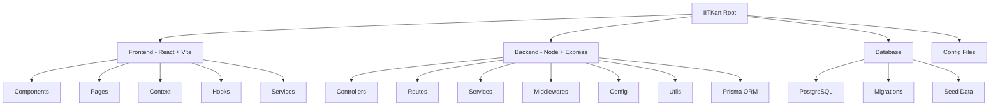

# IITKart

Backend documentation at `backend/README.md`

## Frontend

```bash
# Commands to start development server
npm install
npm run dev
```

# Planned Structure


## Project Structure Diagram



This diagram represents the high-level monorepo architecture of IITKart.

---

## 1. Root Directory

```
IITKart/
├── frontend/                 
├── backend/                  
├── database/                 
├── .gitignore                
├── README.md                 
└── package.json              
```

---

## 2. Backend Structure

```
backend/
├── src/
│   ├── config/
│   ├── controllers/
│   ├── middlewares/
│   ├── routes/
│   ├── services/
│   ├── utils/
│   ├── app.ts
│   └── server.ts
│
├── prisma/
│   ├── schema.prisma
│   ├── migrations/
│   └── seed.ts
│
├── tests/
├── .env
├── package.json
└── tsconfig.json
```

---

## 3. Frontend Structure

```
frontend/
├── public/
├── src/
│   ├── assets/
│   ├── components/
│   │   ├── ui/
│   │   ├── layout/
│   │   ├── common/
│   │   └── features/
│   ├── context/
│   ├── hooks/
│   ├── layouts/
│   ├── pages/
│   ├── services/
│   ├── types/
│   ├── utils/
│   ├── App.tsx
│   ├── main.tsx
│   └── index.css
│
├── .env
├── package.json
├── tailwind.config.js
├── tsconfig.json
└── vite.config.ts
```

---

## 4. Database Overview

Core Prisma Models:

- User (Customer, Vendor, Rider, Admin)
- VendorProfile
- Product
- Order
- OrderItem
- RiderProfile
- Payment

---

## Notes

- Monorepo architecture for frontend and backend.
- Backend follows Controller–Service pattern.
- Frontend uses feature-based modular design.
- Prisma enables type-safe database access and migrations.
